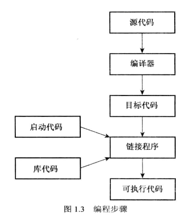
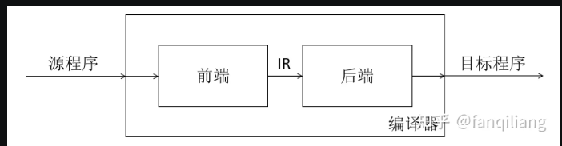
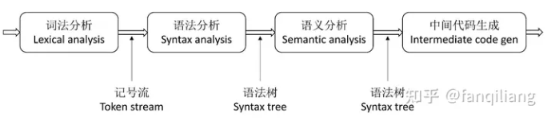
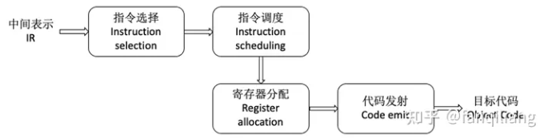
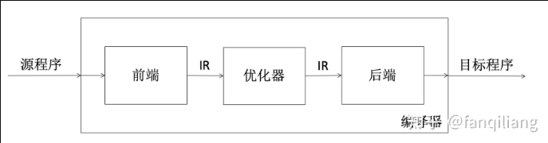
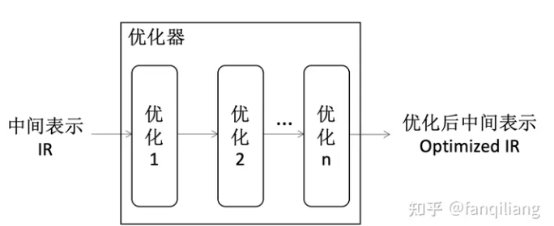
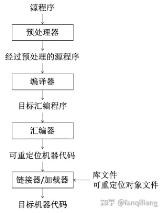
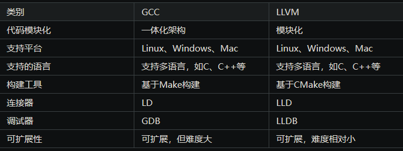

编译器的作用：将一种高级语言编写的程序转换成一种等价的、低级语言（目标语言）编写的程序。

高级语言一般包括C/C++、Java、Python等语言，而低级语言一般包括汇编、字节码或机器码等。

## 编译器的基本结构

### 两段式编译器

最开始，编译器根据任务性质的不同，将其结构分解为两个主要部分：前端（Front-end）和后端（Back-end）

前端，主要是去理解程序的语法形式和内容，即程序的语法和语义；然后，检查源程序代码是否符合正确的语法和语义，如果检查通过，它会给该程序建立一个中间表示代码。前端一般可分为4个阶段，分别为词法分析、语法分析、语义分析和中间代码生成

后端，主要任务是读入程序中间表示形式，并生成目标机器的指令代码，一般也可分为4个阶段，分别为指令选择、指令调度、寄存器分配以及代码发射

### 三段式编译器

现代编译器引入了中端（Middle-end）（优化器）

中端，主要使用合适的优化来提高代码质量，并将优化后的程序输出给后端进行进一步编译。这里的“提高”可以有多种含义，通常指：执行速度更快、运行时耗费资源较少、占用的内存空间较小等，中端优化并不是越多越好，可能会出现互斥的情况，如优化执行速度有可能会导致占用的内存空间变大，所以优化需要根据具体目标进行优化。

- 引入中端目的

1. **前端和后端解耦**。即多个语言的前端都可以生成公共的中端代码，而中端代码又可以进一步生成不同目标机器的代码；
2. **通用优化。**在中端上，可设计并实现与语言以及目标机器无关的程序优化算法，对程序的性能、规模或其它指标进行通用优化。

### 4.1 现代编译器框架

现代主流开源的编译器框架主要有GCC和LLVM，两者的驱动分别为gcc和clang，它们的架构如下图所示：

- 预处理器（Preprocessor）

一个源程序可能被分割成多个模块并且各个模块分别被存放于独立的文件中，那么把源程序聚合在一起的任务，会由预处理器来独立完成，此外，它还负责头文件包含和宏处理等工作。

- 汇编器（Preprocessor）

把编译器生成的汇编语言程序进行处理，生成可重定位的机器代码。

链接器（Linker）

- 大型程序经常被分成多个部分进行开发和编译，这称为分离编译（Separate Compilation）。因此，分离编译所产生的可重定位的机器代码，必须和其他可重定位的目标文件以及库文件链接到一起，才能形成真正能在机器上运行的二进制代码，这个任务由链接器完成。

加载器（Loader）

- 负责将可执行程序（如编译后的可执行文件）从存储介质（如硬盘、闪存等）加载到计算机的内存中，以便执行程序。

此外，一般情况下编译器只是整个编译过程中的一个步骤或者模块，并不指整个编译过程。当然，如果从更广义的角度来讲，把编译器认为是整个编译过程，这种说法也是合理的。

### GCC和LLVM对比

- GCC

1. 优点：经过多年开发和测试的成熟编译器，已经在各种平台上得到了广泛的验证和使用，在稳定性和性能方面非常可靠；
2. 缺点：GCC虽然也是三段式设计，但是代码之间的耦合度过高，所以扩展难度比较大。

LLVM

1. 优点：高度模块化，成为了许多编程语言的首选编译器基础设施；
2. 缺点：文档更新速度慢，相对GCC在某些方面成熟度较低。