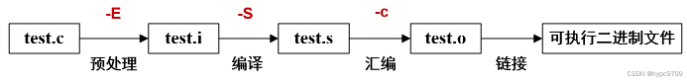

### 编译器在生成obj文件时实际上做的事情：

1.预处理我们的代码，所有的预处理语句会优先处理；

2.将我们的代码进行记号化和解析，即将我们写的高级语言代码转换成编译器能够真正理解和推理的格式，生成抽象语法树；

3.生成实际代码，CPU即将执行的代码；

现在假设我们有一个`main.cpp`和`Log.cpp`文件，代码如下：

```c++
//"main.cpp"

#include<iostream>

void Log(const char* message);      //声明

int main()
{
    Log("Test Log1!");
    std::cout << "Hello World!" << std::endl;
    std::cin.get();
}
```

```c++
//"Log.cpp"

#include<iostream>

void Log(const char* message)
{
    std::cout << message << std::endl;
}

```

当我们点击编译后会生成`.obj`文件：


可以看到代码的文本量并不大只有几行，但是文件大小却有70多KB，这实际上就是预处理语句的作用，在之前我们讲到了预处理语句 `#` 的作用就是将后面的文件复制到语句所在的地方，那么这两个`.cpp`文件中的

```c++
#include<iostream>
```

语句就是将整个iostream文件打包复制到这里，所以两个`.obj`文件的大小会如此大。

在之前我们学习到编译器的工作过程如下：



在`Visual Studio`中设置如下：

`'项目'-'设置'-'配置属性'-'预处理器'-'预处理到文件'-'是'`

设置完毕后再次编译文件，会在文件夹中生成`.i`文件，打开`main.i`文件如下：


。。。。。。。

中间省略n多行，跳到最后，


可以看到前面的预处理语句就是将iostream文件插在前面。

## 其他的预处理语句：

预处理指令在C++源代码编译的预处理阶段执行。预处理指令以“#”开头，并通常在行尾结束。以下是一些常见的C++预处理指令：

#include`: 用于包含一个文件。它可以包含头文件（如、等）或者源文件。例如：`#include <iostream>`

#define`: 用于定义常量或宏。例如：`#define PI 3.14159`

假如我写一条

```c++
#define INTEGER int
```

这条代码的含义就是在后面的代码中搜索所有的`INTEGER`将其替换成`int`。

`#if`, `#ifdef`, `#ifndef`, `#else`, `#elif`, `#endif`: 这些指令用于条件编译。例如：`#ifdef DEBUG`

```c++
	#if 条件
　　#else 否则
　　#elif 否则如果
　　#endif 结束条件
　　#ifdef 或 #if defined 如果定义了一个符号, 就执行操作
　　#ifndef 或 #if !defined 如果没有定义一个符号，就指执行操作
```

1. `#undef`: 用于取消已定义的宏。例如：`#undef DEBUG`
2. `#warning`: 用于在编译时显示警告信息。例如：`#warning "This is a warning message"`
3. `#error`: 用于在编译时显示错误信息，并终止编译。例如：`#error "This is an error message"`
4. `#pragma`: 用于提供特定于编译器的指令。例如：`#pragma once`（在某些编译器中用于防止头文件被多次包含）

注意，预处理指令应该在任何实际的C++代码之前执行，包括注释和空白行。它们只处理到源文件的开头，并不关心程序的运行时行为。

总而言之，编译器的作用就是获取源文件并输出一个`obj`文件，文件中包含机器代码以及我们定义的常数数据。

`obj`文件通过链接器链接成一个包含所有内容的可执行文件。
