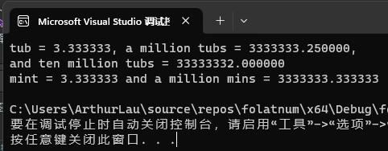
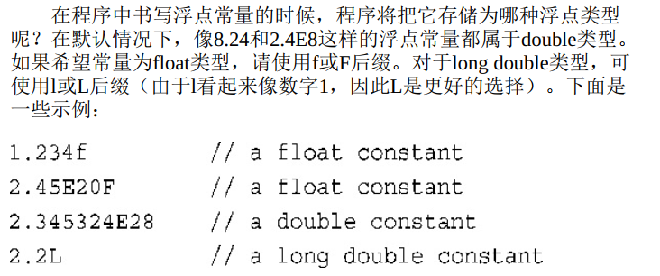

## `char`类型：字符和小整数

`char`类型是专为存储字符（如字母和数字）而设计的。  

**计算机是如何存储字母的？**

编程语言通过使用字母的数值编码解决了这个问题。  

因此， char类型是另一种整型。它足够长，能够表示目标计算机系统中的**所有基本符号**—**所有的字母、数字、标点符号等**。

实际上，很多系统支持的字符都不超过128个，因此用一个字节就可以表示所有的符号。

因此，虽然char最常被用来处理字符，但也可以将它用做比short更小的整型。   

**ASCII字符集**  

字符集中的字符用数值编码（ASCII码）表示。例如，字符A的编码为65，字母M的编码为77。  

```c++
// morechar.cpp -- the char type and int type contrasted
#include <iostream>

int main()
{
	using namespace std;
	char ch = 'M';
	int i = ch;
	cout << "The ASCII code for " << ch << " is " << i << endl;

	cout << "Add one to the character code: " << endl;
	ch += 1;
	i = ch;
	cout << "The ASCII code for " << ch << " is " << i << endl;

	// using the cout.put() member function to display a char
	cout << "Displaying char ch using cout.put(ch): ";
	cout.put(ch);

	// using cout.put() to display a char constant
	cout.put('!');

	return 0;
 }

/*
output:
The ASCII code for M is 77
Add one to the character code:
The ASCII code for N is 78
Displaying char ch using cout.put(ch): N!
*/
```

这里的`cout.put()`可以显示一个字符。

## cout.put()

**`cout.put( )`到底是什么东西？其名称中为何有一个句点？**

函数`cout.put( )`是一个重要的`C++ OOP`概念—成员函数—的第一个例子。

**类**定义了如何表示和控制数据。**成员函数**归类所有，描述了操纵类数据的方法。

例如类`ostream`有一个`put( )`成员函数，用来输出字符。

只能通过类的特定对象（例如这里的`cout`对象）来使用成员函数。

要通过对象（如`cout`）使用成员函数，必须用**句点**将对象名和函数名称（`put( )`）连接起来。

句点被称为**成员运算符**。 `cout.put( )`的意思是，通过类对象`cout`来使用函数`put( )`。  

### 为什么需要`cout.put()`?

答案与历史有关。  

在C++的Release 2.0之前， `cout`将**字符变量**显示为字符，而将**字符常量**（如‘M’和‘N’）显示为数字。

问题是， C++的早期版本与C一样，也将把字符常量存储为int类型。也就是说， ‘M’的编码77将被存储在一个16位或32位的单元中。而char变量一般占8位。  


**Unicode字符集** 宽字符类型`wchar_t`

C++支持的宽字符类型可以存储更多的值，如国际`Unicode`字符集使用的值。

## 转义符

有些字符不能直接通过键盘输入到程序中。

例如，按回车键并不能使字符串包含一个换行符；

相反，程序编辑器将把这种键击解释为在源代码中开始新的一行。

其他一些字符也无法从键盘输入，因为C++语言赋予了它们特殊的含义。

例如，双引号字符用来分隔字符串字面值，因此不能把双引号放在字符串字面值中。

对于这些字符， C++提供了一种特殊的表示方法—转义序列。

如下代码：

```c++
char alarm = '\a';
cout << alarm << "Don't do that again! \a\n";
cout << "Ben \"Bggsie\" Hacker\nwas here!\n";
```

\`a`表示振铃字符，它可以使终端扬声器振铃。  

`\"`将双引号作为常规字符，而不是字符串分隔符。  

上面那段代码的输出结果如下：

```c++
/*
“响铃” Don't do that again! “响铃”
Ben "Buggsie" Hacker
was here!
*/
```

输出结果中的`“响铃”`代表终端扬声器振铃.


关于换行符的使用有如下代码示例：

```c++
cout << endl;	// using the endl manipulator
cout << '\n';	// using a character constant
cout << "\n";	// using a string
```

换行符可替代`endl`，用于在输出中重起一行。

可以以字符常量表示法（`‘\n’`）或字符串方式（`“n”`）使用换行符。  

下面的程序使用振铃字符来提请注意，使用换行符使光标前进，使用退格字符使光标向左退一格，完成了一个简单的密码登录界面：

```c++
// bondini.cpp -- using escape sequences
#include <iostream>

int main()
{
	using namespace std;
	cout << "\aOperation \"HyperHype\" is now activated!\n";
	cout << "Enter you agent code:________\b\b\b\b\b\b\b\b";
	long code;
	cin >> code;
	cout << "\aYou entered " << code << "...\n";
	cout << "\aCode verified! Proceed with Plan Z3!\n";
	return 0;
}
```

这是一个简单的密码输入功能，在如下代码行：

```c++
cout << "Enter you agent code:________\b\b\b\b\b\b\b\b";
```

终端显示“`Enter you agent code:________`”后，使用8个退格符`\b`使光标回到`code：`后面。

此时输入`code`会在下划线的地方显示输入的密码。

同时会利用响铃符`\a`提示用户。

下面是截图：


## `signed char`和`unsigned char`

与int不同的是， char在默认情况下既不是没有符号，也不是有符号。  

如果char有某种特定的行为对您来说非常重要，则可以显式地将类型设置为signed char 或unsigned char：  

```c++
char fodo;	// may be signed, may be unsigned
unsigned char bar;
signed char snark;
```

unsigned char类型的表示范围通常为0～255，而signed char的表示范围为-128到127。  

## `wcha_t`宽字符类型

程序需要处理的字符集可能无法用一个8位的字节表示，如日文汉字系统。

对于这种情况， C++的处理方式有两种。

**第一种办法**，如果大型字符集是实现的基本字符集，则编译器厂商可以将char定义为一个16位的字节或更长的字节。

**第二种办法**，使用两种类型来支持一个小型基本字符集和较大的扩展字符集。

8位`char`可以表示基本字符集，另一种类型`wchar_t`（宽字符类型）可以表示扩展字符集。 

`wchar_t`类型是一种整数类型，它有足够的空间，可以表示系统使用的最大扩展字符集。

这种类型与另一种整型（底层（`underlying`）类型）的长度和符号属性相同。对底层类型的选择取决于实现，因此在一个系统中，它可能是`unsigned short`，而在另一个系统中，则可能是`int`。  

`cin`和`cout`将输入和输出看作是`char`流，因此不适于用来处理`wchar_t`类型。

 `iostream`头文件的最新版本提供了作用相似的工具—`wcin`和`wcout`，可用于处理`wchar_t`流。

另外，可以通过加上前缀L来指示宽字符常量和宽字符串。下面的代码将字母P的`wchar_t`版本存储到变量bob中，并显示单词tall的`wchar_t`版本  ：

```c++
wchar_t bob = L'P';	// a wide-character constant
wcout << L'tall' <<endl;	// outputting a wide-character string
```

## C++11新增的类型： `char16_t`和`char32_t`  

C++11使用前缀u表示`char16_t`字符常量和字符串常量，如`u'C'`和`u"be good"`；

并使用前缀U表示`char32_t`常量，如`U'R'`和`U"dirty rat"`。  

## `bool`类型

`bool`类型只有两个值，`true or false`，1代表`true`，0代表`false`。

任何数字值或指针值都可以被隐式转换（即不用显式强制转换）为bool值。

任何非零值都被转换为true，而零被转换为false：  

```c++
bool start = -100;	// start assigned true, if print start, it's 1
bool stop = 0;	// stop assigned false
```

## `const`限定词

如果程序在多个地方使用同一个常量，则需要修改该常量时，只需修改一个符号定义即可。  

```c++
const int Months = 12;	// Months is symbolic constant for 12
```

常量（如Months）被初始化后，其值就被固定了，编译器将不允许再修改该常量的值。  

### `const`相较于`#define`的优点：

首先，它能够明确指定类型。

其次，可以使用C++的作用域规则将定义限制在特定的函数或文件中（作用域规则描述了名称在各种模块中的可知程度）。

第三，可以将const用于更复杂的类型，如数组和结构。  

## 浮点数

浮点数能够表示带小数部分的数字，它们提供的值范围也更大。

如果数字很大，无法表示为`long`类型，如人体的细菌数（估计超过100兆），则可以使用浮点类型来表示。  

浮点数分为两部分，一部分是基准值，第二部分是缩放因子。

对于数字34.1245和34124.5，它们除了小数点的位置不同外，其他都是相同的。

可以把第一个数表示为0.341245（基准值）和100（缩放因子），而将第二个数表示为0.341245（基准值相同）和10000（缩放因子更大）。  

缩放因子的作用就是移动小数点的位置，这也是浮点数名字的由来。

C++内部表示浮点数的方式是二进制而不是十进制。

### 浮点数的书写方式

浮点数书写方式有两种：

#### 1.常用的标准小数点表示法：


#### 2.E表示法：


例如3.45E6，代表的是3.45*10^6.

E表示法适合用于表示非常大和非常小的数。


### 浮点类型

C++也有3种浮点类型： `float`、 `double`和`long double`。  

按它们可以表示的有效数位和允许的指数最小范围来描述的。  

有效位（significant figure）是数字中有意义的位。

例如，加利福尼亚的Shasta山脉的高度为14179英尺，该数字使用了5个有效位，指出了最接近的英尺数。

然而，将Shasta山脉的高度写成约14000英尺时，有效位数变成了2位，其余3位叫做占位符。

通常， float为32位， double为64位， long double为80、 96或128位。另外，这3种类型的指数范围至少是-37到37。

 

```c++
// floatnum.cpp -- floating-point types
#include <iostream>

int main()
{
	using namespace std;
	cout.setf( ios_base::fixed, ios_base::floatfield );
	float tub = 10.0 / 3.0;
	double mint = 10.0 / 3.0;
	const float million = 1.0e6;

	cout << "tub = " << tub;
	cout << ", a million tubs = " << million * tub;
	cout << ",\nand ten million tubs = " << 10 * million * tub << endl;

	cout << "mint = " << mint << " and a million mins = " << million * mint << endl;
	return 0;
}
```

该程序的输出为：



这是一个简单的浮点数运算的程序，其中的`cout.setf()`的作用为迫使输出使用定点表示法，以便更好地了解精度，它防止程序把较大的值切换为E表示法，并使程序显示到小数点后6位。

参数`ios_base::fixed`和`ios_base::floatfield`是通过包含`iostream`来提供的常量。  

假如删掉

```c++
cout.setf( ios_base::fixed, ios_base::floatfield );
```

后，程序的输出会变成：


**float的精度比double低。** 

`tub`和`mint`都被初始化为`10.0/3.0—3.333333333333333333……`

由于`cout`打印6位小数，因此`tub`和`mint`都是精确的。

但当程序将每个数乘以一百万后， tub在第7个3之后就与正确的值有了误差。 

tub在7位有效位上还是精确的（该系统确保float至少有6位有效位，但这是最糟糕的情况）。

然而， double类型的变量显示了13个3，因此它至少有13位是精确的。由于系统确保15位有效位，因此这就没有什么好奇怪的了。

另外，将tub乘以一百万，再乘以10后，得到的结果不正确，这再一次指出了float的精度限制。



### 浮点数的优缺点：

**浮点数有两大优点：**

首先，它们可以表示整数之间的值。

其次，由于有缩放因子，它们可以表示的范围大得多。

**浮点数的缺点：**

浮点运算的速度通常比整数运算慢，且精度将降低。  

下面是一个显示浮点数缺点的代码：

```c++
// fltadd.cpp -- precision problems with float
#include <iostream>

int main()
{
	using namespace std;
	float a = 2.34E22f;
	float b = a + 1.0f;

	cout << "a = " << a << endl;
	cout << "b - a = " << b - a << endl;
	
	return 0;
}
```

这里由于浮点数的精度缺点，使得 `b-a`的结果不是 1 而是 0。


