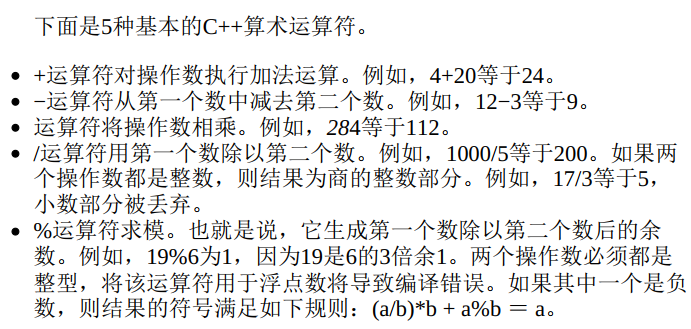
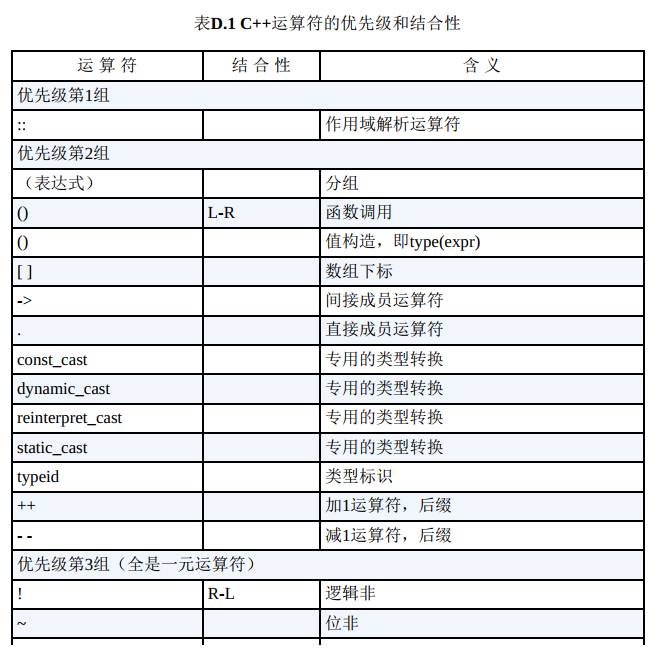
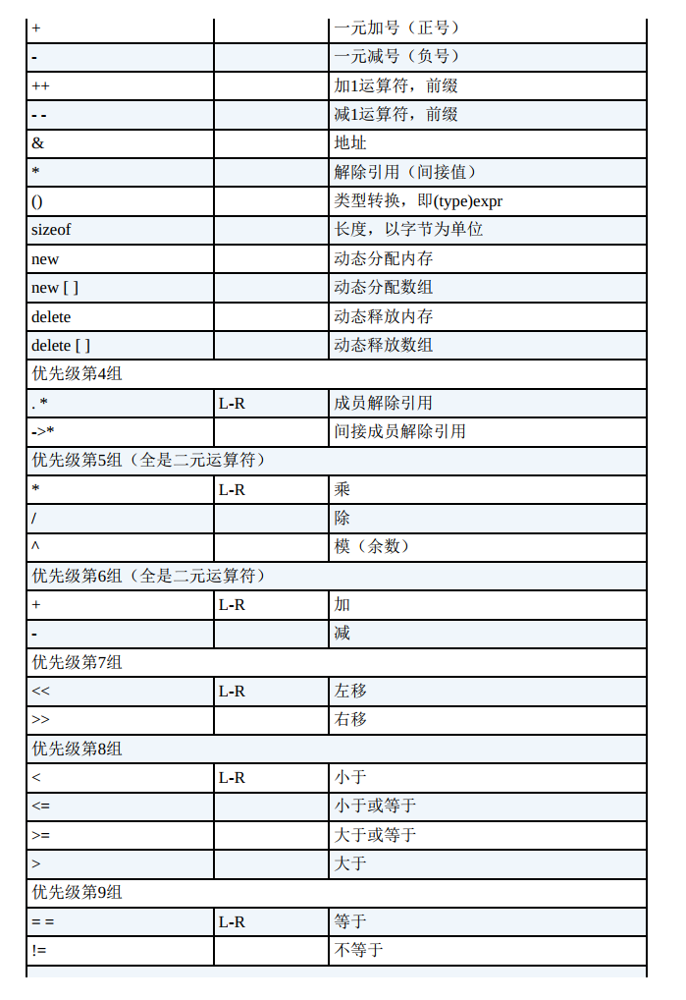
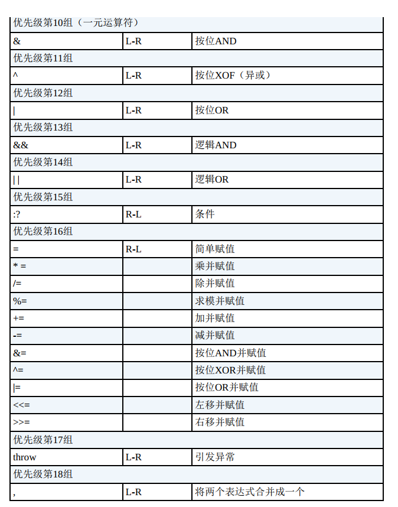
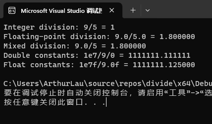
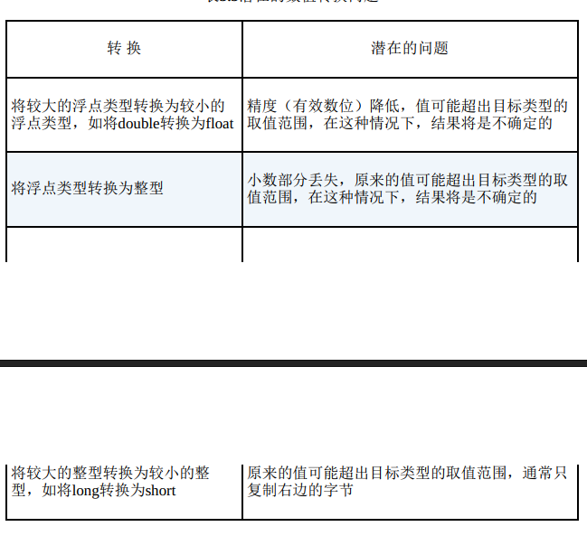
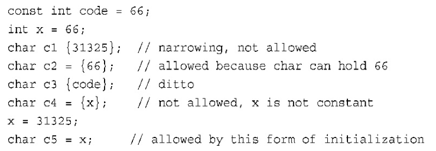
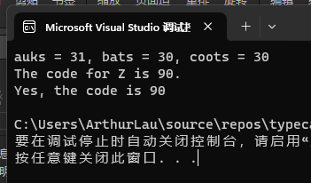
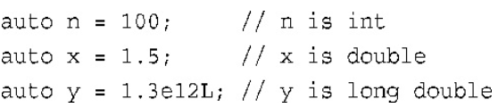

# C++算术运算符



## 运算符优先级和结合性







对于加减乘除来说，优先级和日常使用一样，先乘除后加减。

```c++
char * str = "Whoa";
char ch = *str++;
```

上述例子中，编译器必须决定是先进行解除引用`(*str)`还是先对`str`递增。

`++`的优先级高于一元运算符，则代表`++`作用的对象是`指针str`而不是`指针str所指向的字符串str`。

由于++是后缀形式，因此将在将`*str`的值赋给`ch`后，再将指针加1。因此，上述表达式将字符W赋给`ch`，然后移动指针str，使之指向字符h。  

那么此时的结果是`ch = 'W'` `指针str = 'h'`

假设将++移动到前缀：

```c++
char * str = "Whoa";
char ch = *++str;
```

前缀++运算符和一元运算符的优先级相同，但它们是从右到左结合的。

因此， `指针str`（不是`指针str所指向的字符串str`）将被加1。因为`++`运算符是前缀形式，所以首先将`str`加1，然后将得到的指针执行解除引用的操作。因此， str将指向字符h，并将字符h赋给ch。  

## 除法分支：

如果两个操作数都是整数，则C++将执行整数除法。

这意味着结果的小数部分将被丢弃，使得最后的结果是一个整数。如果其中有一个（或两个）操作数是浮点值，则小数部分将保留，结果为浮点数。  

```c++
// divide.cpp -- integer and floating-point division
#include <iostream>

int main()
{
	using namespace std;
	cout.setf(ios_base::fixed, ios_base::floatfield);
	cout << "Integer division: 9/5 = " << 9 / 5 << endl;
	cout << "Floating-point division: 9.0/5.0 = " << 9.0f / 5.0f << endl;
	cout << "Mixed division: 9.0/5 = " << 9.0f / 5 << endl;
	cout << "Double constants: 1e7/9/0 = " << 1.e7 / 9.0 << endl;
	cout << "Float constants: 1e7f/9.0f = " << 1e7f / 9.0f << endl;

	return 0;
}
```



对不同类型进行运算时， C++将把它们全部转换为同一类型。

最后两行的相对精度表明，如果两个操作数都是double类型，则结果为double类型；

如果两个操作数都是float类型，则结果为float类型。

记住，***浮点常量在默认情况下为double类型。***  

## 取模运算符

求模运算符返回整数除法的余数。

它与整数除法相结合，尤其适用于解决要求将一个量分成不同的整数单元的问题，

例如将英寸转换为英尺和英寸，或者将美元转换为元、角、分、厘。  

下面的程序将磅转换为英石 (一英石等于14磅  )。

```c++
// modulus.cpp -- uses % operator to convert lbs to stone
#include <iostream>

int main()
{
	using namespace std;
	const int Lbs_per_stn = 14;
	int lbs;

	cout << "Enter your weight in pounds: ";
	cin >> lbs;
	int stone = lbs / Lbs_per_stn;
	int pounds = lbs % Lbs_per_stn;
	cout << lbs << " pounds are " << stone << " stone, " << pounds << " pound(s)." << endl;

	return 0;
}
```

## 类型转换：

**C++会自动进行多种类型转换：**

将一种算术类型的值赋给另一种算术类型的变量时， C++将对值进行转换；

表达式中包含不同的类型时， C++将对值进行转换；

将参数传递给函数时， C++将对值进行转换。

### 1.初始化和赋值进行的转换

例如，假设so_long的类型为long， thirty的类型为short， 若代码中有如下语句：

```c++
so_long = thirty;
```

在进行赋值时，程序将thirty的值（通常是16位）扩展为long值（通常为32位）。扩展后将得到一个新值，这个值被存储在so_long中，**而thirty的内容不变。**  

将一个值赋给值取值范围更大的类型通常不会导致什么问题。  

**但是当一个很大的long值赋给范围较小的类型时，会发生精度问题。**



在之前讲到过`bool`类型，将0赋给bool变量时，将被转换为false；而非零值将被转换为true。  

```c++
bool n = 0; // n flase
bool n = -100; // n true
```

```c++
// assign.cpp -- type changes on initialization
#include <iostream>

int main()
{
	using namespace std;
	cout.setf(ios_base::fixed, ios_base::floatfield);
	float tree = 3;
	int guess(3.8854);
	int debt = 7.2e12;
	cout << "tree = " << tree << endl;
	cout << "guess = " << guess << endl;
	cout << "debt = " << debt << endl;
	return 0;
}

/*
output:
tree = 3.000000
guess = 3
debt = 1634811904
*/
```

将浮点数转换为整型时，C++采取的是**截断**而不是四舍五入，所以这里的guess是3.

int变量debt无法存储3.0E12，这导致C++没有对结果进行定义的情况发生。在这种系统中， debt的结果为1634811904，或大约1.6E09。  

### 2.以`{}`方式初始化时进行的转换（C++11）

C++11将使用大括号的初始化称为列表初始化（`list-initialization`），因为这种初始化常用于给复杂的数据类型提供值列表。  

它对类型转换的要求更严格。  

列表初始化不允许缩窄（narrowing），即变量的类型可能无法表示赋给它的值。  

例如，不允许将浮点型转换为整型。

在不同的整型之间转换或将整型转换为浮点型可能被允许，条件是编译器知道目标变量能够正确地存储赋给它的值。

例如，可将long变量初始化为int值，因为long总是至少与int一样长；

相反方向的转换也可能被允许，只要int变量能够存储赋给它的long常量  ；



### 3.表达式中的转换

**当同一个表达式中包含两种不同的算术类型时，将出现什么情况呢？**

在这种情况下， C++将执行两种自动转换：

​	**1.一些类型在出现时便会自动转换；**

​	**2.有些类型在与其他类型同时出现在表达式中时将被转换。**  

#### 1.自动转换

在计算表达式时， C++将`bool、 char、 unsigned char、 signed char和short`值转换为`int`。具体地说， `true`被转换为1， `false`被转换为0。这些转换被称为整型提升（`integral promotion`）。  

假设有下面的语句：

```c++
short chickens = 20;
short ducks =35;
short fowl = chickens + ducks;
```

执行第三句语句时，先获取`chickens`和`ducks`的值，将其转化为`int`类型，计算完毕后再转化为`short`类型。

通常将int类型选择为计算机最自然的类型，这意味着计算机使用这种类型时，**运算速度可能最快。**  


将不同类型进行算术运算时，也会进行一些转换  。**较小的类型将被转换为较大的类型。**  

### 4.传递参数时的转换

传递参数时的类型转换通常由C++函数原型控制。

C++将对char和short类型（signed和unsigned）应用整型提升。

另外，为保持与传统C语言中大量代码的兼容性，在将参数传递给取消原型对参数传递控制的函数时， C++将float参数提升为double。  

### 5.强制类型转换

强制类型转换**不会修改**变量本身，而是创建一个新的、指定类型的值，可以在表达式中使用这个值。  

强制类型转换有两种格式：

```c++
(typeName) value;
typeName (value);
```

第一种格式来自C语言，第二种格式是纯粹的C++。  

```c++
// typecast.cpp -- forcing type changes
#include <iostream>

int main()
{
	using namespace std;
	int auks, bats, coots;

	auks = 19.99 + 11.99;

	bats = (int) 19.99 + (int) 11.99;
	coots = int (19.99) + int(11.99);
	cout << "auks = " << auks << ", bats = " << bats << ", coots = " << coots << endl;
	
	char ch= 'Z';
	cout << "The code for " << ch << " is " << int(ch) << "." << endl;
	cout << "Yes, the code is " << static_cast<int>(ch) << endl;

	return 0;
}
```



这行语句：

```c++
	auks = 19.99 + 11.99;
```

先进行运算，得到结果31,98.

虽然后面的数字都是浮点型，但是由于auks是int类型，所以结果（31.98）被截断为31.

```c++
	bats = (int) 19.99 + (int) 11.99;
	coots = int (19.99) + int(11.99);
```

这两行语句是一样的，在运算时先将19.99和11.99转化为int类型，也就是19 + 11，结果是30.

`static_cast<>`可用于将值从一种数值类型转换为另一种数值类型。  

## C++11中的`auto`声明

在C++11中，关键字`auto`可以让编译器能够根据初始值的类型推断变量的类型。  



处理复杂类型，如标准模块库（STL）中的类型时，使用`auto`会很方便。

例如：

```c++
std::vector<double> scores;
std::vector<double>::iterator pv = scores.begin();
```

可以改写为：

```c++
std::vector<double> scores;
auto pv = scores.begin();
```

