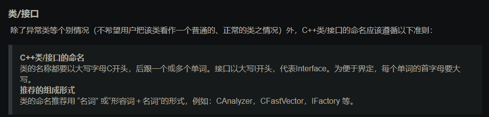
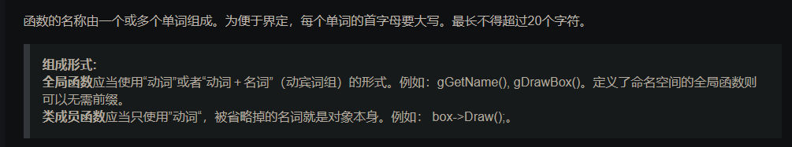
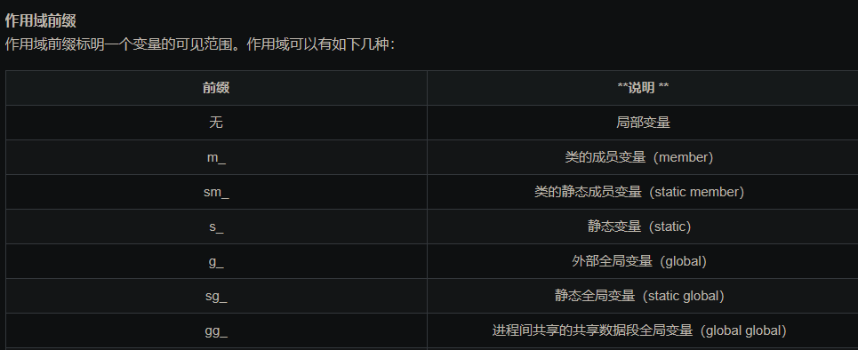
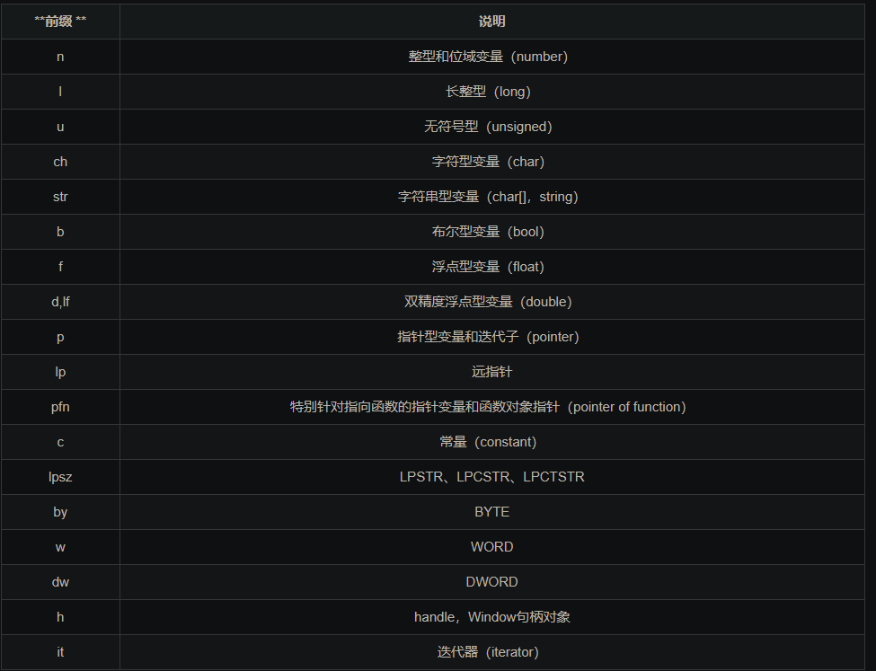
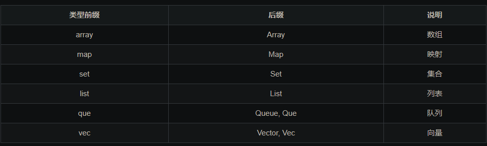
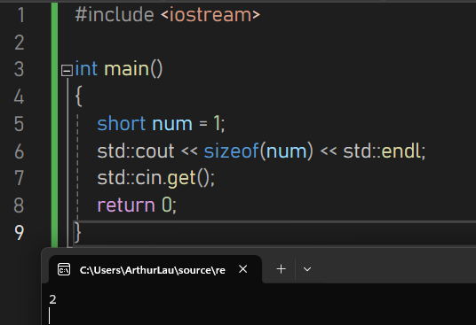
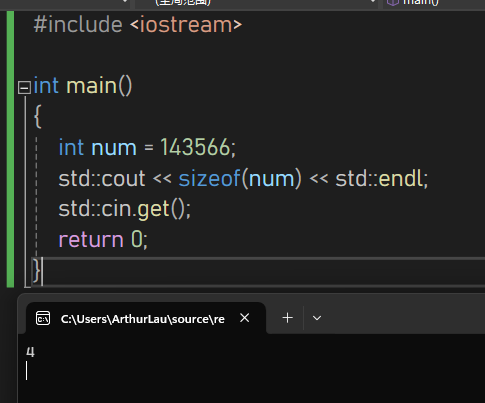
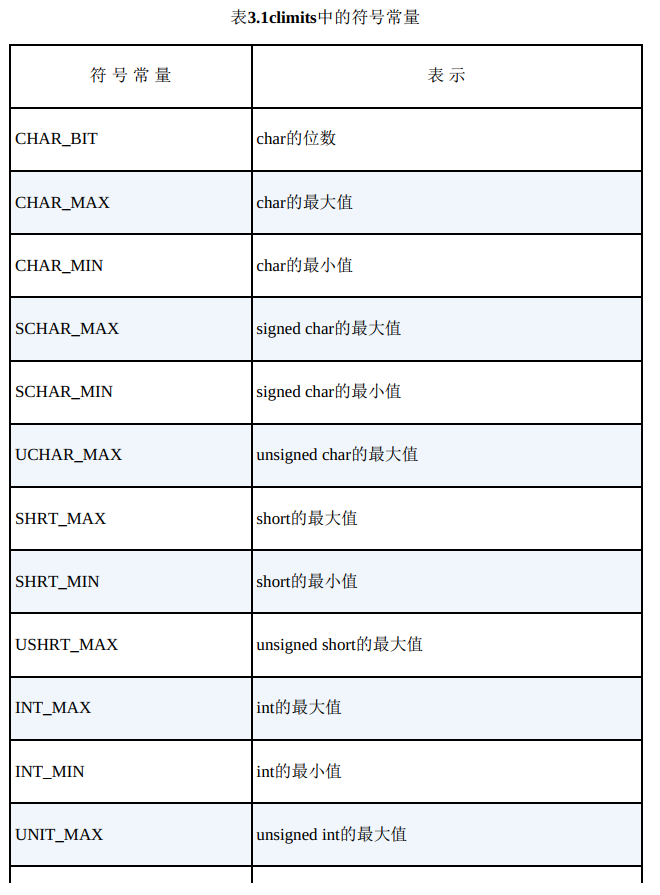
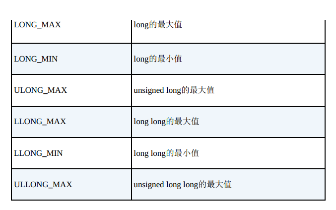

 内置的C++类型分两组：基本类型和复合类型。

基本类型，即整数和浮点数。

在基本类型的基础上创建的复合类型，包括数组、字符串、指针和结构。  

## C++变量的命名规则

在名称中只能使用字母字符、数字和下划线（_）。

名称的第一个字符不能是数字。

区分大写字符与小写字符。

不能将C++关键字用作名称。

**以两个下划线或下划线和大写字母打头的名称被保留给实现（编译器及其使用的资源）使用。**

​	这些名称通常用于实现内部的编译器特性、库函数或其他用途，应避免在用户代码中使用这些名称，以免与编译器或库的实现发生冲突。

1. `__cplusplus`: 这是一个预定义的宏，用于指示当前编译器是否支持C++语言。
2. `__FILE__`: 这是一个预定义的宏，表示当前源文件的文件名。
3. `__LINE__`: 这是一个预定义的宏，表示当前源文件的行号。
4. `__func__`: 这是一个预定义的标识符，在函数内部表示当前函数的名称。
5. `_Exit`: 这是C标准库中的函数，用于立即终止程序的执行。
6. `_IO_FILE`: 这是C标准库中的结构体类型，用于表示文件流的信息

以一个下划线开头的名称被保留给实现，用作全局标识符。

C++对于名称的长度没有限制，名称中所有的字符都有意义，但有些平台有长度限制。

## 变量命名法则

1.驼峰命令法，正如它的名称所表示的那样，是指混合使用大小写字母来构成变量和函数的名字。
示例：`printEmployeePaychecks()`

2.匈牙利命名法，通过在变量名前面加上相应的小写字母的符号标识作为前缀，标识出变量的作用域、类型等。这些符号可以多个同时使用，

顺序是先m_(成员变量)、再指针、再简单数据类型、再其它。这样做的好处在于能增加程序的可读性，便于对程序的理解和维护。匈牙利命名法关键是：标识符的名字以一个或者多个小写字母开头作为前缀；前缀之后的是首字母大写的一个单词或多个单词组合，该单词要指明变量的用途。
示例：`m_lpszStr`,表示指向一个以0字符结尾的字符串的长指针成员变量。

3.帕斯卡命名法（也叫大驼峰命名），与驼峰命名法类似，二者的区别在于：驼峰命名法是首字母小写，而帕斯卡命名法是首字母大写，
示例：`DisplayInfo()`;  `string UserName`

4.下划线命名法，常用于python的编程命名中，示例：`print_employee_paychecks()`





变量
变量应该是程序中使用最多的标识符了，变量的命名规范可能是一套C++命名准则中最重要的部分。

变量名由 作用域前缀＋类型前缀＋一个或多个单词＋数据结构标识 组成，为便于界定，每个单词的首字母要大写。其中对于“数据结构标识”可以作为类型前缀使用，也可以作为后缀使用。对于某些用途简单明了的局部变量，也可以使用简化的方式，如：`i, j, k` 。

作用域前缀
作用域前缀标明一个变量的可见范围。作用域可以有如下几种：


类型前缀标明一个变量的类型：



**数据结构标识**



**推荐的组成形式**
变量的名字应当使用“名词”或者“形容词＋名词”。例如：`nCode，m_fPostionX，mapTemp，m_nResultList ，g_strFileNameArray`等。

## 整型

整数就是没有小数部分的数字 。

不同C++整型使用不同的内存量来存储整数。使用的内存量越大，可以表示的整数值范围也越大。

另外，有的类型（符号类型）可表示正值和负值，而有的类型（无符号类型）不能表示负值。

术语宽度（width）用于描述存储整数时使用的内存量。使用的内存越多，则越宽。 

C++的基本整型（按宽度递增的顺序排列）分别是char、 short、int、 long和**C++11新增的long long 。**

**short至少16位；** -32768到+32767  

**int至少与short一样长；**

**long至少32位，且至少与int一样长；** 

**long long至少64位，且至少与long一样长。**

可以通过`sizeof()`关键字得到变量类型的长度，例如：

`short` 2字节



`int` 4字节



头文件 `<climits>`中包含了关于整型限制的信息。具体地说，它定义了表示各种限制的符号名称。例如， `INT_MAX`为`int`的最大取值， `CHAR_BIT`为字节的位数。  

```c++
#include <iostream>
#include <climits>

int main()
{
	using namespace std;
	int n_int = INT_MAX;	//	initialize n_int to max int value
	short n_short = SHRT_MAX;
	long n_long = LONG_MAX;
	long long n_llong = LLONG_MAX;

	// sizeof operator yields size of type or of variable
	cout << "int is " << sizeof(n_int) << " bytes. " << endl;
	cout << "short is " << sizeof(n_short) << " bytes. " << endl;
	cout << "long is " << sizeof(n_long) << " bytes. " << endl;
	cout << "long long  is " << sizeof(n_llong) << " bytes. " << endl;
	cout << endl;

	cout << "Maximum values: " << endl;
	cout << " int : " << n_int << endl;
	cout << " short : " << n_short << endl;
	cout << " long : " << n_long << endl;
	cout << " long long : " << n_llong << endl << endl;

	cout << "Minimum int value = " << INT_MIN << endl;
	cout << "Bits per byte = " << CHAR_BIT << endl;

	cin.get();
	return 0;
}

/*
output:
int is 4 bytes.
short is 2 bytes.
long is 4 bytes.
long long  is 8 bytes.

Maximum values:
 int : 2147483647
 short : 32767
 long : 2147483647
 long long : 9223372036854775807

Minimum int value = -2147483648
Bits per byte = 8
*/
```

### 运算符`sizeof`

`sizeof`对类型名使用时，需要用到括号。

但对变量名使用时，可以省略括号。

```c++
sizeof(int);
sizeof n_int;
```

### 头文件`<climits>`





### 变量初始化

初始化将赋值与声明合并在一起。  

```C++
int n_int = IMT_MAX;
```

在C++中，还有另一种C语言没有的初始化语法：

```c++
int owls = 101;	// traditional C initialization, sets owls to 101
int wrens(432);	// alternative C++ syntax, set wrens to 432
```

如果不对函数内部定义的变量进行初始化，该变量的值将是这个变量被创建之前相应内存空间之前的值。

### C++11初始化方法

还有另一种初始化方式，这种方式用于数组和结构，但在C++98中，也可用于单值变量：  

```c++
int hamburgers = {24};
```

在C++11中，可以使用等号也可以不使用，大括号内不包含任何东西时，变量将会被初始化为0：

```c++
int emus{7};
int rheas = {12};

int rocs = {}; 	// set rocs to 0
```

**为什么会有这些奇怪的初始化方式？**

这有助于更好地防范类型转换错误 。

## 无符号类型

前面讲到的`short，int，long，long long`都有一种不能存储负数值的无符号变体，其优点是可以增大变量能够存储的最大值。  

原理就是将作为符号位的一位数也拿来存储数值。

例如`short`表达的范围为`-32768 到 +32767`，但是`unsigned short`表达的范围为`0 到 65535`。

```c++
// exceed.cpp -- exceeding some integer limits
#include <iostream>
#define ZERO 0	// make ZERO symbol for 0 value
#include <climits>

int main()
{
	using namespace std;
	
	short sam = SHRT_MAX;
	unsigned short sue = sam;

	cout << "Sam has " << sam << " dollars and Sue has " << sue;
	cout << " dollars deposited. " << endl
		<< "Add $1 to each account. " << endl << "Now ";
	
	sam += 1;
	sue += 1;
	
	cout << "Sam has " << sam << " dollars and Sue has " << sue;
	cout << " dollars deposited. \nPoor Sam!" << endl << endl ;

	sam = ZERO;
	sue = ZERO;

	cout << "Sam has " << sam << " dollars and Sue has " << sue;
	cout << " dollars deposited. " << endl;
	cout << "Take $1 from each account. " << endl << "Now ";
	
	sam -= 1;
	sue -= 1;

	cout << "Sam has " << sam << " dollars and Sue has " << sue;
	cout << " dollars deposited. " << endl << "Lucky Sue! " << endl;

	return 0;
}

/*
output:
Sam has 32767 dollars and Sue has 32767 dollars deposited.
Add $1 to each account.
Now Sam has -32768 dollars and Sue has 32768 dollars deposited.
Poor Sam!

Sam has 0 dollars and Sue has 0 dollars deposited.
Take $1 from each account.
Now Sam has -1 dollars and Sue has 65535 dollars deposited.
Lucky Sue!
*/
```

该程序很好的讲清了整型的边界值以及无符号数的相关内容。

初始均给`sam`和`sue`赋给`SHRT_MAX`即32767，然后给两个变量分别+1，由于`sam`是`short`变量，此时已经越过边界，所以回到-32768，而`sue`是无符号数，变成32768。

然后将两个变量均赋值0，再同时-1，`short`类型的`sam`可以有负值，所以变成-1，而无符号`short`类型的`sue`的范围是0-65535，-1之后越过左边界，变成了65535。

## 整型字面值

整型字面值（常量）是显式地书写的常量，如212或1776。

与C相同， C++能够以三种不同的计数方式来书写整数：

基数为10、基数为8（老式UNIX版本）和基数为16（硬件黑客的最爱）。

这里将介绍C++表示法。 C++使用前一（两）位来标识数字常量的基数。如果第一位为1～9，则基数为10（十进制）；因此93是以10为基数的。

如果第一位是0，第二位为1～7，则基数为8（八进制）；因此042的基数是8，它相当于十进制数34。

如果前两位为0x或0X，则基数为16（十六进制）；因此0x42为十六进制数，相当于十进制数66。

对于十六进制数，字符a～f和A～F表示了十六进制位，对应于10～15。 0xF为15， 0xA5为165（10个16加5个1）。

```c#
// hexotc.cpp -- shows hex and octal literals
#include <iostream>

int main()
{
	using namespace std;
	int chest = 42;	// decimal integer literal
	int waist = 0x42;	// hexadecimal integer litreal
	int inseam = 042;		// otcal integer literal

	cout << "Monsieur cuts a striking figure! \n";
	cout << "chest = " << chest << " (42 in decimal)" << endl;
	cout << "waist = " << waist << " (0x42 in hex)" << endl;
	cout << "inseam = " << inseam << " (042 in octal)" << endl;
	
	return 0;
}

/*
output:
Monsieur cuts a striking figure!
chest = 42 (42 in decimal)
waist = 66 (0x42 in hex)
inseam = 34 (042 in octal)
*/
```

