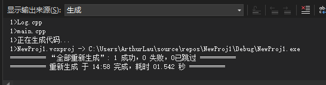

链接是个过程。

在上一期编译器是如何工作的md文档中写到，每个文件被编译成一个单独的目标文件，即一个翻译单元，它们之间没有关系。

链接器通常包括两个阶段：符号解析和重定位。符号解析是将目标文件中引用的符号与定义的符号进行匹配，确定符号的地址。重定位是将目标文件中的相对地址转换成绝对地址，以便在运行时正确访问数据和代码。链接器的主要作用是解决符号引用和重定位问题，使得多个源文件能够正确地组合成一个可执行文件。

假设有下面`main.cpp`和`log.cpp`

```c++
//"main.cpp"

#include<iostream>

void Log(const char* message);      //声明

int Multiply(int a, int b)
{
    Log("Multiply");
    return a * b;
}

int main()
{
    std::cout << Multiply(5, 8) << std::endl;
    std::cin.get();
}
```

```c++
//"Log.cpp"

#include<iostream>

void Log(const char* message)
{
    std::cout << message << std::endl;
}

```

那么在我build这个项目时，链接器就会链接这两个文件生成的目标文件，生成可执行文件。在`main.cpp`中的`Log`函数在链接时链接器会寻找到处于`Log.cpp`中的函数定义。

**假设现在将`Log.cpp`中的`Log`函数改写为`Lgor`**

```c++
void Logr(const char* message)	//log -> logr
{
    std::cout << message << std::endl;
}
```

这时候单独编译`main.cpp`和`Log.cpp`文件时不会发生错误，因为没有进行链接。

编译器会相信`main.cpp`中提到的`Log`函数声明是存在的。

但是当我们进行`build`时会发生链接错误。

**如果我们不使用`Log`函数会发生什么？**

现在让我们注释掉`Multiply`函数中`Log`函数的调用语句。

```c++
//"main.cpp"

#include<iostream>

void Log(const char* message);      //声明

int Multiply(int a, int b)
{
    //Log("Multiply");
    return a * b;
}

int main()
{
    std::cout << Multiply(5, 8) << std::endl;
    std::cin.get();
}
```

注释掉`Log`函数调用语句后，由于`Log`函数从未被调用，也就不需要链接，此时整个项目`build`成功，没有发生链接错误。

**但如果我们注释掉的是`main`函数中的`Multiply`函数调用语句会发生什么呢？**

```c++
//"main.cpp"

#include<iostream>

void Log(const char* message);      //声明

int Multiply(int a, int b)
{
    Log("Multiply");
    return a * b;
}

int main()
{
    //std::cout << Multiply(5, 8) << std::endl;
    std::cin.get();
}
```

此时虽然我们也并没有调用`Log`函数，在`main.cpp`文件中也不会用到`Multiply`函数，但是这并不意味着``Multiply``函数不会用在其他文件中。所以链接器会进行链接，也就是寻找`Log`函数。此时便会发生链接错误。


如果我们能告诉编译器，这个`Multiply`函数只会用在`main.cpp`文件中，不会用在其他文件中，就能消除这种错误。

```c++
//"main.cpp"

#include<iostream>

void Log(const char* message);      //声明

static int Multiply(int a, int b)
{
    Log("Multiply");
    return a * b;
}

int main()
{
    //std::cout << Multiply(5, 8) << std::endl;
    std::cin.get();
}
```

当我们将函数`Multiply`标记为`static`时，意味着这个函数只会被声明在这个翻译单元中，此时便能消除链接错误。

**链接器在工作时会经常发生重复定义的错误。**

现在假设将`Log`函数放进头文件`Log.h`中。

```c++
//"Log.h"
#pragma once

void Log(const char* message)
{
    std::cout << message << std::endl;
}

```

`Log.cpp`修改如下，功能是输出语句显示`Log`功能初始化。

```c++
//"Log.cpp"

#include <iostream>
#include "Log.h"

void InitLog()
{
	Log("Initialized Log");
}

```

`main`函数修改如下

```c++
//"main.cpp"

#include <iostream>
#include "Log.h"


static int Multiply(int a, int b)
{
    Log("Multiply");
    return a * b;
}

int main()
{
    std::cout << Multiply(5, 8) << std::endl;
    std::cin.get();
}
```

看起来很正常，但是当我们选择`build`时，发生链接错误。


为什么会发生这种错误呢？

前面讲到预处理语句`#include`的工作原理，就是将它包含的文件简单复制到`#include`所在的地方。那么我们便可以将源文件修改为如下：

```c++
//"main.cpp"

#include <iostream>
//#include "Log.h"

void Log(const char* message)
{
    std::cout << message << std::endl;
}


static int Multiply(int a, int b)
{
    Log("Multiply");
    return a * b;
}

int main()
{
    std::cout << Multiply(5, 8) << std::endl;
    std::cin.get();
}
```

```c++
//"Log.cpp"

#include <iostream>
//#include "Log.h"

void Log(const char* message)
{
    std::cout << message << std::endl;
}

void InitLog()
{
	Log("Initialized Log");
}

```

这样看来就是会产生两个一模一样的`Log`定义，链接器在工作时不知道选择链接哪一个，尽管它们都是一样的。

**如何修正这个错误？**

我们可以将头文件中的`Log`函数定义为`static`静态的，这意味着在链接时，`Log`函数只能是内部函数。

```c++
//"Log.h"
#pragma once

static void Log(const char* message)
{
    std::cout << message << std::endl;
}

```

此时重新`build`，没有错误产生。



另一个办法是使用`inline`，`inline`会将函数替换成具体的函数体。

```c++
//"Log.h"
#pragma once

inline void Log(const char* message)
{
    std::cout << message << std::endl;
}

```

使用inline后，实际上`main.cpp`会变成这样：

```c++
//"main.cpp"

#include <iostream>
#include "Log.h"


static int Multiply(int a, int b)
{
    std::cout << "Multiply" << std::endl;
    return a * b;
}

int main()
{
    std::cout << Multiply(5, 8) << std::endl;
    std::cin.get();
}
```

第三种方法是只在头文件中声明函数，具体的定义放在其他文件中。

例如将`Log`函数的定义放在`Log.cpp`中

```c++
//"Log.cpp"

#include <iostream>
#include "Log.h"

void InitLog()
{
	Log("Initialized Log");
}

void Log(const char* message)
{
    std::cout << message << std::endl;
}

```

头文件修改如下：

```c++
#pragma once

void Log(const char* message)；

```

